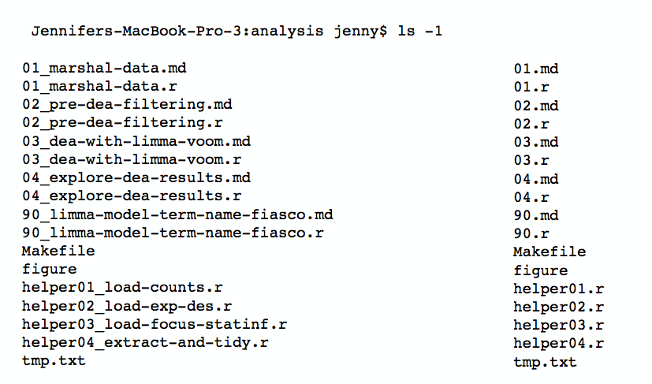

## Intro to Reproducible Science

Adapted from the Reproducible Science Curriculum
_Special Thanks: Francois Michonneau, Hilmar Lapp, Karen Cranston, Jenny Bryan, and everyone else who contributed to these materials. NEON has adapted them to our week long data institute._

##

> Reproducibilty is actually all about being as lazy as possible!

-- Hadley Wickham (via
[Twitter](https://twitter.com/hadleywickham/status/598532170160873472),
2015-05-03)

<section>
  <aside class="notes">
    I'm your Notes :)
  </aside>
</section>

## What’s in it for me?

> more efficient, less redundant science: others can build upon our work

## What’s in it for me?

> [Five selfish reasons to work reproducibly](http://www.genomebiology.com/2015/16/1/274) - Florian Markowetz

1. Reproducibility helps to avoid disaster
2. Reproducibility makes it easier to write papers
3. Reproducibility helps reviewers see it your way
4. Reproducibility enables continuity of your work
5. Reproducibility helps to build your reputation

## Who do we need to share with?

* collaborators
* peer reviewers & journal editors
* broad scientific community
* generally the public

> For research to be reproducible, the research products (data, code) need to be publicly available in a form that people can find and understand them.

## Better Research

<small>Figure 1. Distribution of reporting errors per paper for papers from which data were shared and from which no data were shared.</small>

[Wicherts et al (2011) Willingness to Share Research Data Is Related to the Strength of the Evidence and the Quality of Reporting of Statistical Results.](http://dx.doi.org/10.1371/journal.pone.0026828)

## The tools

* GitHub: Version Control / Collaboration
* R Markdown: Code documentation / publication

## Four Facets of Reproducibility

1. Documentation
2. Organization
3. Automation
4. Dissemination

_Over the next week, we will focus on these elements related to reproducibility._

## 1. Documentation

Document all workflow steps:

* You can remind your future self of your workflow
* Others can see and understand your work
* Future "re-analysis" of your data is more efficient

## Documentation

Code should be easy to understand with clear goals

> Document your code even if you think it's clear and simple. Your collaborators
> & your future self will inevitably have an easier time working with it down the road.

## Documentation Pro-Tip 1

> Add comments around functions that describe purpose, inputs and outputs.

## Documentation Pro-Tip 2
>  Avoid proprietary formats: e.g. text files (.txt,.md) don't require special tools to open.

## Documentation Pro-Tip 3
>  Markdown to style documentation = machine readable, low overhead

## Documentation Pro-Tip 4

Use coding approaches that connect data cleaning, analysis & results

> e.g. r markdown, ipython notebooks

## 2. Organization

The more self explanatory the better:

* Consider overall structure of folders and files
* Use informative file names

##

Source:
<a  href=http://journals.plos.org/ploscompbiol/article?id=10.1371/journal.pcbi.1000424' target="_blank">
  A quick guide to organizing computational biology projects. </a>

## 2. Organization

File Organization should:

* Reflect inputs, outputs and information flow.
* Preserve raw data so it's not modified.
* Carefully document & store intermediate & end outputs.
* Carefully document & store data processing scripts.

## Organization

## 2. Organization -- File Names

File / Folder Names should be:

* Machine readable
* Human readable
* Support sorting in a clear way

## Human Readable Naming

> Which set of file names do you want at 3am before a deadline?

## Organization
More on File Naming & organization
http://reproducible-science-curriculum.github.io/2015-09-24-reproducible-science-duml/naming-slides/assets/player/KeynoteDHTMLPlayer.html

## 2. Organization - Benefits

* Your future self will be able to quickly find files.
* Colleagues will be able to more quickly understand your workflow.
*  Machine readable names can be quickly and easily sorted and parsed.

## 3. Automation

DRY -- Don't Repeat Yourself

> If your analysis is composed of scripts, with repeated components in multiple parts of your code, it will be more time consuming to maintain and update.

http://reproducible-science-curriculum.github.io/2015-09-24-reproducible-science-duml/slides/01-automation-slides.html#9

## Automation

Modularity -- use functions to write code in reusable chunks

* Variables created within a function are temporary
* Cleaner code
* Allows for better documentation
* Supports testing
* Allows for re-use of code on other data.

## Automation

## Dissemination

> Publishing is not the end of your analysis, rather it is a way station towards
> your future research and the future research of others

## Dissemination - Why

http://reproducible-science-curriculum.github.io/2015-09-24-reproducible-science-duml/slides/01-publication-slides.html#/5
** increased visibility?
** fewer errors?

## Dissemination workflow

Example Workflow (R Focused):

* Document workflow **Rmarkdown / Jupiter Notebooks**
* Collaborate with Colleagues / Version Control : **GitHub**
* Publish Data Snapshot: **FigShare, Dryad, etc**
* Share workflow: ** RPubs , Ipython Notebook Viewer**
