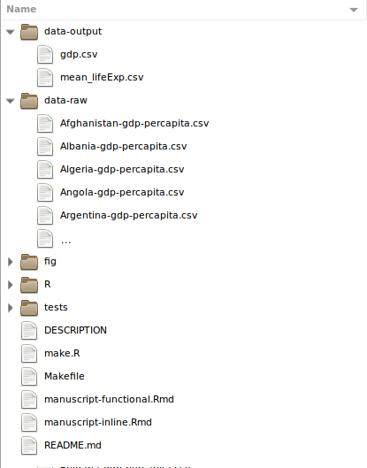

## Intro to Reproducible Science

Adapted from the Reproducible Science Curriculum

## 

>Reproducibilty is actually all about being as lazy as possible!

-- Hadley Wickham (via
[Twitter](https://twitter.com/hadleywickham/status/598532170160873472),
2015-05-03)

<section>
  <aside class="notes">
    I'm your Notes :)
  </aside>
</section>

## Four Facets of Reproducibility

1. Documentation
2. Organization
3. Automation
4. Dissemination

Over the next week, we will focus on these elements related to reproducibility.

## 1. Documentation
 
* Document all workflow steps:
	* You can remind your future self of your workflow
	* Others can see and understand your work
	* Future "re-analysis" of your data is more efficient

	
## Documentation

Code should be easy to understand with clear goals

> Document your code even if you think it's clear and simple. Your collaborators & your future self will inevitably have an easier time working with it down the road!

## Documentation Pro-Tips

> Add comments around functions that describe purpose, inputs and outputs. 
       

## Documentation Pro-Tips
*  Use a widely read format: Text files (.txt, .md) don't require special tools to read.
* Markdown to style documentation = machine readable, low overhead
* Programming approaches that connect data cleaning, analysis & results

## 2. Organization

* Consider overall structure of folders and files
* Use informative file names
* The more self explanatory the better

Graphic: 
http://reproducible-science-curriculum.github.io/2015-09-24-reproducible-science-duml/organization-slides/assets/player/KeynoteDHTMLPlayer.html#6

## 2. Organization

File Organization should:

* Reflect inputs, outputs and information flow.
* Preserve raw data so it's not modified.
* Consider well documented storage of intermediate & end outputs.
* Consider storage of associated scripts used to process data.

## 2. Organization -- File Names

File / Folder Names should be:

* Machine readable
* Human readable
* Support sorting in a clear way

link out??
http://reproducible-science-curriculum.github.io/2015-09-24-reproducible-science-duml/naming-slides/assets/player/KeynoteDHTMLPlayer.html#19

## 2. Organization - Benefits

* Your future self will be able to quickly find files.
*  Colleagues will be able to more quickly understand your workflow.
*  Machine readable names can be quickly and easily sorted and parsed.

## 3. Automation

DRY -- Don't Repeat Yourself

> If your analysis is composed of scripts, with repeated components in multiple parts of your code, it will be more time consuming to maintain and update.

http://reproducible-science-curriculum.github.io/2015-09-24-reproducible-science-duml/slides/01-automation-slides.html#9

## Automation

Modularity -- use functions to write code in reusable chunks

* Variables created within a function are temporary
* Cleaner code
* Allows for better documentation
* Supports testing
* Allows for re-use of code on other data.

## Automation - Functions vs Scripts

...Script based coding may conflict with "Dry" repeated

## Dissemination
: publishing is not the end of your analysis, rather it is a way station towards your future research and the future research of others

## Motivation - Why Bother?

* 

	

